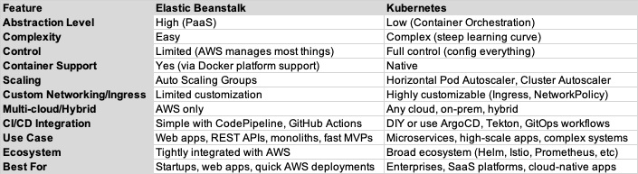

#  Research project

## Objectives & Guidelines

One of the main objectives of this **research project** is to allow you to explore a topic related to **Cloud Computing and Big Data Analytics** that genuinely interests you. This exercise reflects a common and essential practice in the field of computer science, where professionals are often required to **expand their knowledge on emerging technologies** that may become relevant in their day-to-day work.

### What You’re Expected to Do

As part of your research:
- You should be able to **identify reliable and trustworthy sources**, understand their content, and critically assess whether the topic is worth exploring further.
- You are encouraged to invest as much or as little time as needed to evaluate the topic’s potential value to your learning or future career.

### Collaboration & Knowledge Sharing

Another key goal of this assignment is to foster **collaboration and peer learning**. Sharing insights with your classmates helps everyone build a more comprehensive understanding of the field. 

To guide your research and presentation, consider what your classmates might want to know about your topic. Use the following questions to shape your focus (these are **not** intended to be used as a report outline):

- **Relevance**: What would someone need to know to decide whether it's worth diving deeper into this topic or moving on to something else?
- **Community Insight**: What are people saying about this technology or concept? Is it widely adopted? Is it considered mature, promising, or problematic?
- **Personal Perspective**: What has been your experience while exploring this subject? What lessons did you learn?
- **Learning Resources**: Share useful resources (e.g., websites, articles, blogs, PDFs, courses) that can help others learn more.

### Presentation Matters

Finally, an important aspect of this assignment is your ability to **communicate your findings clearly, concisely, and engagingly**. Keep in mind:
- Your classmates may not have much time or prior interest in your topic.
- Make your presentation **brief, informative, and appealing** — think of it as a **mini-tutorial** that sparks curiosity.

## Instructions to deliver the assignment

> [!important]
> Each team must work on a **different topic**. To reserve a topic, send an email to your instructor listing **three preferred topics in order of priority**.
> Topics will be assigned on a **first-come, first-served** basis.

Each project team (consisting of **4 members**) will prepare a **tutorial** on one of the topics listed below or another topic that:
- Is being used in their main course project, **or**
- Sparks the team's curiosity and is worth exploring further.

### Deliverables

Your team must:
1. Create a folder named `research` inside your **project repository**.
2. Inside that folder, add a file: `research/tutorial/README.md`
3. If you need slides for your in-class presentation include a **PDF file** `research/tutorial/presentation.pdf`.

The `research` folder should include your tutorial content — **explanations, images, code snippets, visualizations**, etc. — following the same style and structure used in the lab sessions.

### Evaluation Criteria

The tutorial will be assessed based on:
- The **clarity and completeness** of your documentation,
- The **quality of the presentation**, and
- The **feedback provided by your peers**.

After evaluation, all approved tutorials will be added to the main course repository to serve as shared learning resources for future students.

## Topics proposed

### Using the AWS SAM CLI with Serverless.tf for local debugging and testing of Serverless applications

 [serverless.tf](https://serverless.tf/) is an opinionated open-source framework for developing, building, deploying, and securing serverless applications and infrastructures on AWS using Terraform. The [AWS Serverless Application Model](https://docs.aws.amazon.com/serverless-application-model/) Command Line Interface ([AWS SAM CLI](https://docs.aws.amazon.com/serverless-application-model/latest/developerguide/using-sam-cli.html)) can be used with Serverless.tf modules for local debugging and testing your AWS Lambda functions and layers.

### Chalice: a framework for writing serverless applications in Python

AWS [Chalice](https://aws.github.io/chalice/) is an open-source microframework developed by Amazon that allows you to quickly create and deploy serverless applications in Python. It’s designed to work seamlessly with AWS services like Lambda, API Gateway, S3, SQS, and SNS. You can think of Chalice as Flask or FastAPI, but for serverless apps.

### Serverless Framework: multi-cloud serverless

The [Serverless Framework](https://www.serverless.com) is a powerful open-source tool that simplifies the development and deployment of serverless applications across various cloud providers (AWS, Microsoft Azure and Google Cloud), with a primary focus on AWS Lambda. It enables developers to define infrastructure and application code using a concise YAML syntax, facilitating the creation of scalable and cost-effective serverless solutions. 

### Observability with New Relic integrated in AWS

It is all about gaining deep insights into your application’s health, performance, and user experience. [New Relic](https://newrelic.com/) is a powerful observability platform that helps you monitor everything from backend infrastructure to frontend user behavior—all in real time. It easily integrates with Python (`pip install newrelic`) and supports EC2, RDS, Lambda, API Gateway, S3, CloudWatch, and more.

### Observability with Dynatrace integrated in AWS

[Dynatrace](https://www.dynatrace.com/) is an AI-powered observability platform designed for modern cloud-native environments. Like New Relic, it offers full-stack monitoring—but with heavy emphasis on automation, AI root cause analysis (via its engine called Davis AI), and real-time dependency mapping. It offers a deep integration with AWS: Lambda, EC2, ECS, EKS, RDS, S3, CloudWatch, etc.

### AWS EKS as an alternative to AWS Elastic Beanstalk

[AWS EKS](https://docs.aws.amazon.com/eks/latest/userguide/what-is-eks.html) is a fully managed Kubernetes service that lets you run **Kubernetes** on AWS without having to install, manage, or maintain the control plane. It’s the AWS-native way to run Kubernetes with integration into other AWS services like IAM, VPC, CloudWatch, and more.

### AWS Fargate

[AWS Fargate](https://docs.aws.amazon.com/eks/latest/userguide/fargate.html) is a serverless compute engine for containers. You don’t have to provision or manage EC2 instances — you just define your containers and Fargate runs them. It works with both AWS ECS, and AWS EKS. You focus on containers, Fargate handles the servers.

### AWS Athena

[AWS Athena](https://docs.aws.amazon.com/athena/latest/ug/what-is.html) is a serverless, interactive query service that enables users to analyze data directly in AWS S3 using standard SQL. There is no need to manage infrastructure, and it is designed to provide a simple and cost-effective way to query large datasets.

### AWS SageMaker AI

[AWS SageMaker AI](https://docs.aws.amazon.com/sagemaker/latest/dg/whatis.html) is a fully managed service provided by AWS that enables developers and data scientists to build, train, and deploy machine learning models with large scalability. It simplifies the process of building, training, and deploying machine learning models by providing an integrated environment with all the tools and infrastructure needed.

Following the AWS Academy Machine Learning Foundation course that introduces the concepts and terminology of Artificial Intelligence and machine learning in the context of AWS, provide an overview and a tutorial based on the exercises.

### AWS Forecast

[AWS Forecast](https://docs.aws.amazon.com/forecast/latest/dg/what-is-forecast.html) s a fully managed service by Amazon Web Services that uses machine learning to deliver highly accurate time series forecasts. It's based on the same technology Amazon uses for its own retail business, and it doesn’t require you to have ML expertise to use it effectively.

Following the AWS Academy Machine Learning Foundation course that introduces the concepts and terminology of Artificial Intelligence and machine learning in the context of AWS, provide an overview and a tutorial based on the exercises.

### AWS Q Business

[AWS Q Business](https://docs.aws.amazon.com/amazonq/latest/qbusiness-ug/what-is.html) is a fully managed, generative-AI powered assistant that you can configure to answer questions, provide summaries, generate content, and complete tasks based on your enterprise data. It allows end users to receive immediate, permissions-aware responses from enterprise data sources with citations, for use cases such as IT, HR, and benefits help desks.

Following the AWS Academy Machine Learning Foundation course that introduces the concepts and terminology of Artificial Intelligence and machine learning in the context of AWS, provide an overview and a tutorial based on the exercises.

### AWS Glue

[AWS Glue](https://docs.aws.amazon.com/glue/latest/dg/what-is-glue.html) is a fully managed ETL (Extract, Transform, Load) service that simplifies and automates the data integration process. It features a central metadata repository known as the Glue Data Catalog, utilizes a serverless Apache Spark ETL engine, and offers a flexible scheduler for orchestrating jobs. AWS Glue can help streamline data workflows by providing these integrated tools that handle various aspects of data preparation, loading, and transformation without the need to manage infrastructure. 

###

| TEAM  | TOPIC                                          | MEMBERS |
|-------|------------------------------------------------|------------|
| 11_01 | AWS Glue                                       | ANNA MONSO, DANIEL WERONSKI, IVAN MARTINEZ YATES, MARC PARCERISA |
| 11_02 | AWS Athena                                     |    BRUNA BARRAQUER, NAYARA COSTA, QIUCHI CHEN, ZHENGYONG JI |
| 11_03 | Observability with Dynatrace integrated in AWS | DAVIDE LAMAGNA EZGI SENA KARABACAK MEHMET OGUZ ARSLAN POL VERDURA |
| 11_04 |                                                |BAPTISTE KRUGLER LEONARDO EGIDATI MATTEO SALARI XAVIER LOPEZ MANES|
| 12_01 |                                                |ALEXIS VENDRIX GABRIEL GUERRA FERNANDEZ JOAN RODRIGUEZ GARCIA NASHLY ERIELIS GONZALEZ |
| 12_02 |                                                |HEIDI RASMUSSEN JOSEPH WINTERS LARS FLEM XIN TONG |
| 12_03 | AWS SageMaker AI |JAKOB EBERHARDT KOSINSKI BARTOSZ PABLO FABRICIO AGUIRRE GUAMAN VALDEMAR BANG VOJTECH BESTAK |

## Deadline

May 11th 2025

In-class presentations May 12th 2025. **Presence required!**

