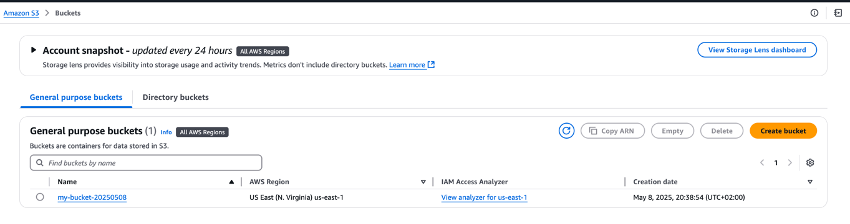
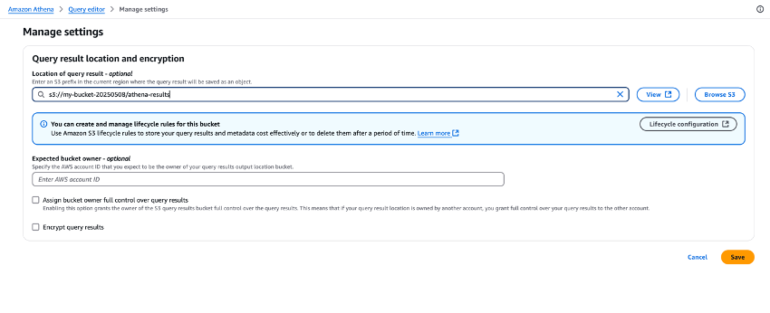
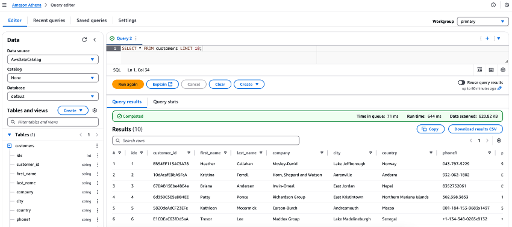
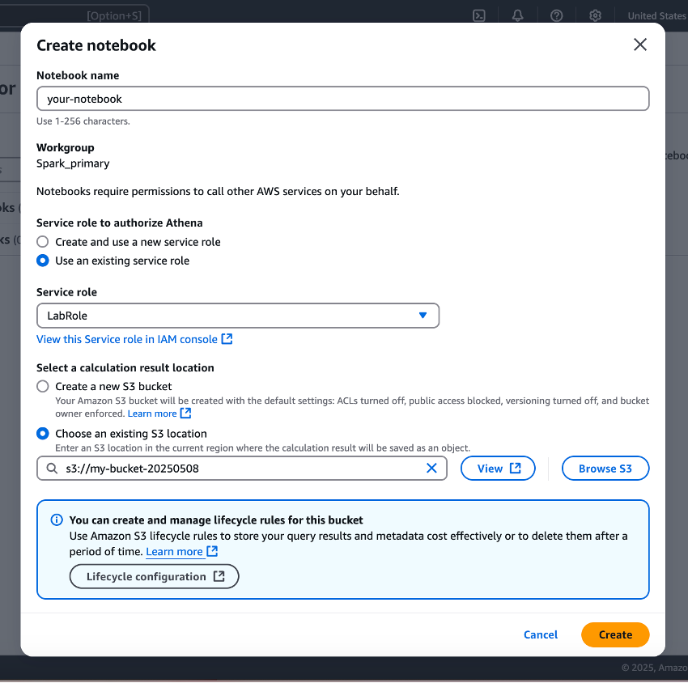

# AWS Athena

## Introduction 

AWS Athena is a serverless, interactive query service that allows you to analyze data directly in Amazon S3 using standard SQL. It’s particularly useful when working with large datasets, or when you want to avoid setting up your own infrastructure. In this tutorial, we'll walk through the entire process of using Athena, starting from downloading a CSV file, uploading it to S3, and then using Athena to analyze it. By the end, you’ll have a working SQL interface over your CSV data, ready for complex querying, joins, filtering, and even integrations with other AWS services.


## Create AWS S3 Bucket

To begin, first launch AWS lab learner and store the temporary credentials into an environment file. 
After that, open a terminal and configure your AWS CLI by running aws configure and entering the provided credentials. If the lab provides a web console link, simply click it to open AWS Console in your browser with pre-authenticated access—no manual credential entry required. Ensure you're operating in the us-east-1 region.

After this step, download the file [customers file](https://github.com/CCBDA-UPC/2025-Project-11_02_A/blob/main/customers-10000.csv), to upload it into the AWS S3 Bucket. 

- Ensure that the AWS CLI is properly authenticated. If you're using Learner Lab, the lab might automatically set environment variables for access. You can test your authentication by running a simple command such as:
```
aws sts get-caller-identity
```
- Next, confirm that your data.csv file is in your working directory by listing the files:
```
ls
```

- If it appears, proceed to upload it. Before uploading, you must create a new S3 bucket with a unique name like *my-bucket-20250508* under *us-east-1* region.
Remember, AWS buckets must be globally unique and only contain hyphens.
To create a new S3 bucket from the terminal, run:
```
aws s3 mb s3://your-bucket-name --region your-region
```

- Once the bucket is created, you can upload the CSV file using the following command:
``` 
aws s3 cp customers-10000.csv s3://my-bucket-20250508/
```

This command will upload data.csv to the root of your specified S3 bucket.
Go to AWS Learner Lab, and test if the bucket has been created properly:


## Create table from S3 bucket data

With the file in S3, move on to AWS Athena by navigating to the Athena console in your AWS account. The first time you open Athena, you'll need to create an table. This is simply another S3 folder where Athena will store query results. You can either create a new S3 bucket or specify a subfolder in your existing bucket (e.g., s3://your-bucket-name/athena-results/):





Now, create a python file named `create_athena_table.py`, with the following code, in order to create a table in athena. 

``` 
import boto3

athena = boto3.client('athena', region_name='us-east-1')  

database_name = "mydata"
output_location = "s3://my-bucket-20250508/athena-results/"  # Replace with your bucket

def run_query(query, database=None):
    params = {
        'QueryString': query,
        'ResultConfiguration': {'OutputLocation': output_location}
    }
    if database:
        params['QueryExecutionContext'] = {'Database': database}
    
    response = athena.start_query_execution(**params)
    return response['QueryExecutionId']

def wait_for_query(query_execution_id):
    while True:
        result = athena.get_query_execution(QueryExecutionId=query_execution_id)
        state = result['QueryExecution']['Status']['State']
        if state in ['SUCCEEDED', 'FAILED', 'CANCELLED']:
            break

# Step 1: Create the database (if not exists)
create_db_query = f"CREATE DATABASE IF NOT EXISTS {database_name};"
wait_for_query(run_query(create_db_query, database=None))

# Step 2: Create the table
create_table_query = """
CREATE EXTERNAL TABLE IF NOT EXISTS customers (
  idx INT,
  customer_id STRING,
  first_name STRING,
  last_name STRING,
  company STRING,
  city STRING,
  country STRING,
  phone1 STRING,
  phone2 STRING,
  email STRING,
  subscription_date STRING,
  website STRING
)
ROW FORMAT SERDE 'org.apache.hadoop.hive.serde2.OpenCSVSerde'
WITH SERDEPROPERTIES (
  "separatorChar" = ",",
  "quoteChar" = "\\""
)
LOCATION 's3://my-bucket-20250508/'  -- replace with actual bucket path
TBLPROPERTIES ('skip.header.line.count'='1');
"""
wait_for_query(run_query(create_table_query))

print("Database and table created successfully.")
```


Finally, upload the data into the table:

```
aws s3 cp customers-10000.csv s3://my-bucket-20250508/customers/
```


And see your results in AWS Athena, selecting the table's top 10 rows.




## Analyzing Athena-Accessible Data Using Athena Notebooks


In this section, we’ll explore how to use Athena Notebooks—an interactive, Jupyter-style environment built directly into the Athena console—to analyze data stored in Amazon S3 using SQL and Python. This approach provides the flexibility to run standard SQL queries and enhance your analysis with Python.

Athena Notebooks are powered by Apache Zeppelin and support multi-language cells, allowing you to use both SQL and Python with %sql and %py magic commands. This is ideal for rapid data exploration, light transformations, and inline visual storytelling—all from within the AWS console.

- Log in to the AWS Console and navigate to the Athena service. In the left sidebar, click on "Notebooks". Then, click the "Create notebook" button. You’ll be prompted to give your notebook a name (e.g., *your-notebook*). 
- Select existing service role: LabRole
- Choose the Amazon S3 bucket we have just created



Once the notebook is ready, you’ll be presented with a Jupyter-like interface directly inside the Athena console. The notebook includes code cells, output areas, visualizations, and support for markdown annotations—making it perfect for documentation and storytelling with your data.

- Create a new notebook called Customer Analysis, and paste the following code: 

```
# Run a SQL query on the Glue Catalog table
df = spark.sql("""
    SELECT country, COUNT(*) AS count
    FROM customers
    GROUP BY country
    ORDER BY count DESC
""")

# Show the result
df.show()
```


In this tutorial, you learned how to analyze S3-based data—originally queried through Athena—using PySpark and Spark SQL in a managed notebook environment.  This workflow combines the scalability of Spark with the flexibility of SQL and Python, making it ideal for modern, serverless data analytics on AWS.


