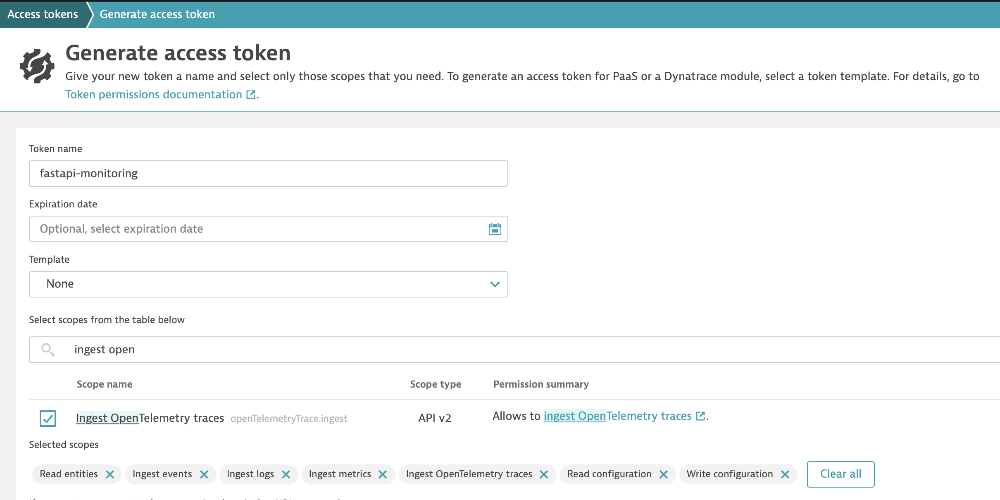
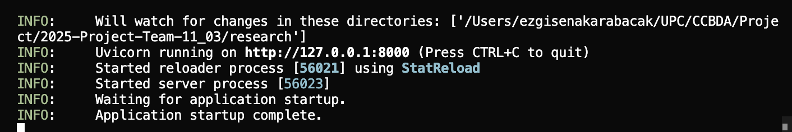
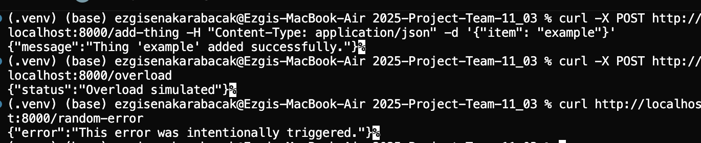

# Observability with Dynatrace

This project demonstrates full-stack observability using **dynatrace-demo**, **OpenTelemetry**, and **Dynatrace**. It includes metrics, logs, distributed traces, and Real User Monitoring (RUM).

---

## 📊 What is Dynatrace?

[Dynatrace](https://www.dynatrace.com/) is an all-in-one observability platform designed to monitor applications, infrastructure, and user experience in real-time. It uses advanced AI and automation to deliver insights across the full software stack, making it easy to detect anomalies, optimize performance, and ensure reliability.

### 🌟 Key Features

- **Full-Stack Monitoring:** Tracks metrics, logs, and traces across infrastructure, applications, and networks.
- **Davis AI Engine:** Uses AI to automatically detect problems and root causes.
- **Real User Monitoring (RUM):** Captures actual user behavior and experience.
- **Infrastructure Monitoring:** Supports cloud platforms (AWS, Azure, GCP), containers, and Kubernetes.
- **Application Security:** Detects vulnerabilities in real-time in running applications.
- **Dashboards & Alerts:** Customizable visualizations and real-time alerting.

### 🧪 Try Dynatrace for Free

You can sign up for a **15-day free trial** with full feature access here:  
👉 [https://www.dynatrace.com/trial/](https://www.dynatrace.com/trial/)

After registration, you’ll receive a link to your Dynatrace environment where you can start exploring dashboards, metrics, and traces right away.

## 🔧 Features

- **Add Thing**: Sends the input to Dynatrace as a log.
- **Overload App**: Runs a CPU-intensive task and reports duration to Dynatrace.
- **Error**: Returns an error with HTTP 500 (This is used for observing alerts in Dynatrace).
- **RUM**: Tracks frontend user behavior using Dynatrace JavaScript tag.

---

# 🧩 Part 1: Backend Setup (dynatrace-demo + Dynatrace)

## 📁 Backend Structure

```bash
.
├── main.py                # dynatrace-demo app with all endpoints
├── otel_tracing.py        # OTLP tracing pipeline setup
├── otel_metrics.py        # OTLP metrics pipeline setup
├── dynatrace_logger.py    # Custom Dynatrace logs integration
├── .env                   # Dynatrace credentials and config
```

### 1. Install dependencies

```bash
pip install -r requirements.txt
```

### 2. Create a Dynatrace API Token

1. Log into your Dynatrace environment: `https://<your-env-id>.live.dynatrace.com`
2. Go to **Settings > Integration > Dynatrace API > Generate new token** or use the search bar and search for Access Tokens.
3. Give it a name (e.g., `dynatrace-demo-monitoring`)
4. Enable the following scopes:
   - `logs.ingest`
   - `metrics.ingest`
   - `entities.read`
   - `events.ingest`
   - `Read configuration`
   - `Write configuration`
   - `ingest OpenTelemetry traces`
5. Copy the token for later use

Your token generation page should look like this: 


### 3. Configure environment variables

Your environment id is written in your homepage link. The link should be like this: 
`https://abc12345.apps.dynatrace.com`
abc12345 is your environment id. 

Create a `.env` file:
```env
DYNATRACE_ENV_ID=your-env-id  # e.g., abc12345
DYNATRACE_API_TOKEN=dt0c01.your-token
DYNATRACE_OTLP_ENDPOINT=https://your-env-id.live.dynatrace.com/api/v2/otlp
```

### 4. Run the app

```bash
uvicorn app:app --reload
```
You should see this output:



### 5. Test Backend Endpoints

You can test endpoints using your browser or a tool like `curl`, `httpie`, or Postman:

```bash
curl -X POST http://localhost:8000/add-thing -H "Content-Type: application/json" -d '{"item": "example"}'
curl -X POST http://localhost:8000/overload
curl http://localhost:8000/random-error
```

For each curl, you should get the corresponding log message:


You can also test the endpoints using the frontend. Open the index.html in browser and try adding things, overloading server and triggering errors.

<p align="center">
  
</p>
<p align="center"><strong>Figure:</strong>Frontend of web app</p>

### 6. View Backend Observability in Dynatrace

- **Traces**: Go to **Observe > Distributed Traces > Ingested Traces**. Filter by `GET /overload`, `GET /error`, etc.

<p align="center">
  
</p>
<p align="center"><strong>Figure:</strong>Traces in Dynatrace</p>

- **Logs**: Search for **Logs** using the search bar. After that you can filter by `service.name:dynatrace-demo-app` or `route:/add-thing`. .
<p align="center">
  
</p>
<p align="center"><strong>Figure:</strong>Logs in Dynatrace</p>

> **Note:** Choose last 24 hours when you try to observe the logs.

- **Metrics**: Go to **Observe > Metrics** and search for `overload_duration_seconds`.

<p align="center">
  
</p>
<p align="center"><strong>Figure:</strong>Metrics for overload in Dynatrace</p>

- **Alerts:** To receive alerts for anomalies like high error rates, you need to configure anomaly detection rules:
1. Go to **Services > Settings > Anomaly Detection**
2. Apply below configurations
<p align="center">
  
</p>
<p align="center"><strong>Figure:</strong>Configuration for alert in Dynatracee</p>

3. Save the configurations
4. You can trigger the error via error button in frontend and in the Dynatrace services section after choosing your app you can see the Problems (Alerts) raised. This allows Dynatrace to detect and notify you of real-time issues, helping you respond quickly to system failures or instability.

<p align="center">
  
</p>
<p align="center"><strong>Figure:</strong>Alert triggered in Dynatrace,
</p>


# 🌍 Part 2: Frontend + Real User Monitoring (RUM)

## 📁 Frontend Structure

```bash
static/index.html          # HTML page with buttons and RUM tag
```

### 1. Create a Web Application in Dynatrace

1. Go to **Applications > Web**
2. Click **Create Custom Application**

<p align="center">
  
</p>
<p align="center"><strong>Figure:</strong>Create custom application</p>

3. Name it (e.g., `dynatrace-demo-app`)
4. Copy the JavaScript snippet:

```html
<script src="https://<your-env-id>.live.dynatrace.com/jstag/<your-app-id>?tag=dynatrace-demo-rum" async></script>
```

5. Paste it into the `<head>` section of `static/index.html`. There is also a comment in index file to point out.

This script will track:
- Page loads
- Session timings
- Click events
- JavaScript errors
- Frontend performance

### 2. Launch and Interact with the Frontend

1. Open `static/index.html` in your browser:
```bash
open static/index.html
```
2. Click the buttons: "Add Thing", "Overload App", or "Random Error".

### 3. View RUM and Frontend Behavior in Dynatrace

Go to:
```
Applications > dynatrace-demo-app > Session Replay, User Actions, JS Errors
```
- See how users interact with the app
- View load time breakdowns
- Inspect top user actions

<p align="center">
  
</p>
<p align="center"><strong>Figure:</strong>Frontend Analytics</p>

<p align="center">
  
</p>
<p align="center"><strong>Figure:</strong>Top user actions</p>


## 📡 How It Works

This project integrates with Dynatrace using several observability channels, allowing you to monitor backend performance, frontend behavior, custom events, and error conditions — all in one place.

---

### 🔁 Tracing (Automatic)

FastAPI routes are automatically instrumented using:

```python
from opentelemetry.instrumentation.fastapi import FastAPIInstrumentor
FastAPIInstrumentor().instrument_app(app)
```

This generates **distributed traces** for every HTTP request.

Traces are exported to Dynatrace using:

```python
from opentelemetry.exporter.otlp.proto.http.trace_exporter import OTLPSpanExporter
```

**Captured automatically:**

- HTTP method and route
- Status codes (e.g., 200, 500)
- Latency and duration

**✅ View in Dynatrace:**

```
Observe > Distributed Traces > Ingested Traces
```

---

### 📊 Metrics (Custom)

The backend defines and exports custom metrics using OpenTelemetry’s `MeterProvider`.

Example:

```python
overload_duration = meter.create_up_down_counter(
    "overload_duration_seconds",
    unit="s",
    description="Duration of overload simulation"
)
```

Metrics are exported using:

```python
from opentelemetry.exporter.otlp.proto.http.metric_exporter import OTLPMetricExporter
```

**Use case:** Track CPU load duration in `/overload`.

**✅ View in Dynatrace:**

```
Observe > Metrics > overload_duration_seconds
```

---

### 🧾 Logs (Manual)

Logs are sent directly to Dynatrace’s Logs Ingest API using a custom function:

```python
def send_log_to_dynatrace(content, level="INFO", **kwargs):
    ...
```

Example payload:

```json
{
  "log.level": "ERROR",
  "route": "/error",
  "content": "Intentional error triggered"
}
```

**✅ View in Dynatrace:**

```
Observe > Logs
```

Use filters like:

- `log.level`
- `route`
- `service.name`

---

### 🌐 RUM (Frontend Monitoring)

The frontend includes the Dynatrace Real User Monitoring (RUM) script:

```html
<script src="https://<your-env-id>.live.dynatrace.com/jstag/<your-app-id>?tag=fastapi-rum" async></script>
```
With the help of that we can track various metrics (Page loads, button clicks, JavaScript errors, user sessions and timings)


