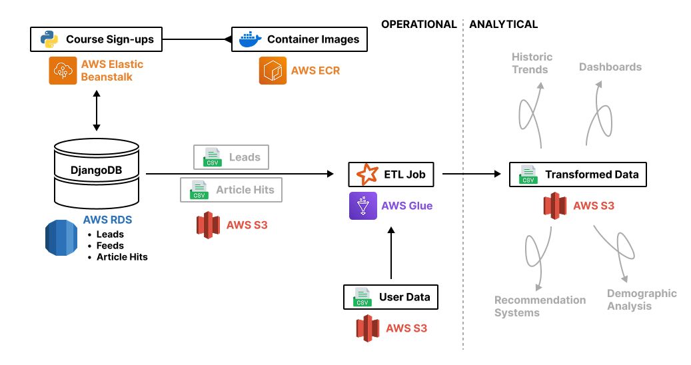
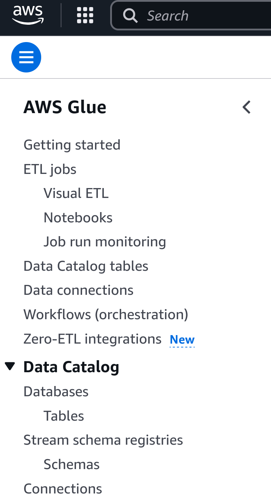
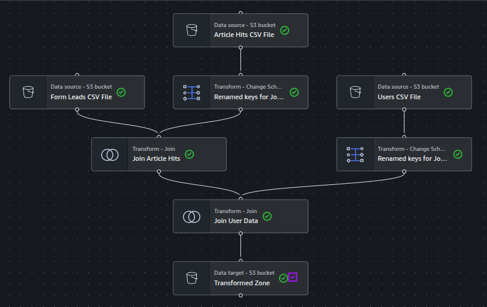

## What is AWS Glue?

AWS Glue is a fully managed serverless data integration service that simplifies discovering, preparing, and combining data for analytics, machine learning, and application development. Designed with data engineers in mind, Glue automates much of the heavy lifting involved in building ETL (extract, transform, load) pipelines by providing tools for data cataloging, job orchestration, and code generation. It supports various data sources and formats, integrates seamlessly with other AWS services, and allows users to write transformations in Python or Scala using Apache Spark under the hood.

Here's an outline of how the system architecture will look like after this tutorial:



## Installation

To follow this tutorial, you need to download the provided code (the `src/` folder, plus the top level scripts such as `deploy_eb.py` script, `requirements.txt` or `eb_options.yaml` files). This code was developed using Python 3.12.3, if you are using a different version, some versions of the packages might not be available. If you stumble upon some issues, please contact us, we might be able to help.

## 1.1. Preparation of the data sources

We will design an ETL pipeline that will extract data from our beloved CCBDA course sign-up page, transform it, and load it into a PostgreSQL database that will serve as a Data Warehouse for our analytics teams. We've modified the Django application to include three new tables in the PostgreSQL database that will be used to store the leads, the feeds, and the article hits.

In this section, we will quickly go through the steps to set up the database and the Django application, as well as generating some synthetic data in a CSV file which we will upload to S3 and use as a data source for the ETL pipeline.

### 1.2. Create a management RDS instance

Go to the AWS console, navigate to RDS and click create a new database. Use the following settings:
- Creation method: Standard create
- Engine: PostgreSQL 17.2-R2
- Template: Free tier
- Availability: Single-AZ
- Identifier: `mds-ccbda-django`
- Master username: `postgres`
- Credentials Management: Self managed
- Master Password: (Set your own, and note it down)
- Instance class: db.t3.micro
- Storage: 20 GB (gp2)
- Public access: Yes (We'll change this later)
Leave the rest of the settings as default and click create database. Skip the suggested add-ons.
Copy the RDS instance endpoint, which you'll find in the RDS console.

We'll need to **make the database available**. To do so, navigate to the **VPC Security Group** of the RDS instance, click on the **Inbound rules** tab, and add a new rule:
- Type: PostgreSQL
- Protocol: TCP
- Port range: 5432
- Source: My IP (or anywhere, but this is not recommended for security reasons)
- Description: Allow access from my IP
Then click on **Save rules**.

Check that you are able to connect to the database by using either DBeaver, your IDE PostgreSQL client, or the command line. 
For the latter, use the following connection string:

> [!NOTE]
> For this, you need to have PostgreSQL installed on your machine. If you don't have it, either connect using another method, or download it from the [PostgreSQL website](https://www.postgresql.org/download/).

```bash
psql -h <your_rds_instance_endpoint> -U postgres -d postgres
```

You'll be prompted for the password you set when creating the database. If everything is correct, you should see a message like this:
```bash
psql (17.4 (Ubuntu 17.4-1.pgdg24.04+2), server 17.2)
SSL connection (protocol: TLSv1.3, cipher: TLS_AES_256_GCM_SHA384, compression: off, ALPN: postgresql)
Type "help" for help.

postgres=> 
```

### 1.3. Prepare the Django project and database

Download the provided Django project, if tou haven't already. Inside the `src` folder, create a new `.env` file with the following content:
```bash
POSTGRES_USER=postgres
POSTGRES_PASSWORD=<your_password>
POSTGRES_DB=postgres
POSTGRES_HOST=<your_rds_instance_endpoint>
POSTGRES_PORT=5432
DJANGO_ALLOWED_HOSTS=localhost:127.0.0.1
DJANGO_SECRET_KEY=jbe89uht9yj934875yh0u9iy
DJANGO_DEBUG=False
```

> [!IMPORTANT]
> Scripts further down this document assume that this project has the following structure:
> ```txt
> ├── src
> │   ├── form
> │   ├── ccbda
> │   ├── static
> │   ├── templates
> │   ├── manage.py
> │   ├── requirements.txt
> │   ├── .env
> │   ├── Dockerfile
> ├── deploy_eb.py
> ├── requirements.txt
> ├── README.md
> ├── ...
> ```
> Make sure that this is the case.

Then, install the required packages:

```bash
pip install -r src/requirements.txt
```

Note that this is the requirements file inside the Django project, not the one used for the deployment scripts. The latter is in the root folder.

> [!TIP]
> It is highly recommended to use a virtual environment for this. You can create one using the following command:
> ```bash
> python3 -m venv .venv
> ```
> Then, activate it using:
> ```bash
> source .venv/bin/activate
> ```

> [!IMPORTANT]
> If `pip install` fails on `psycopg2` (missing `libpq-fe.h`), ensure your `requirements.txt` uses `psycopg2-binary` instead of `psycopg2`. This will avoid any `pip-install` issues you may find.

Then create the migrations:

```bash
python src/manage.py makemigrations form
```

And apply them:

```bash
python src/manage.py migrate
```

You can check that everything was set up correctly by logging into the database and checking that the tables were created. You can do this using DBeaver or the command line:
```bash
psql -h <your_rds_instance_endpoint> -U postgres -d postgres
```
Then, run the following command to list the tables:

```sql
\dt
```

You should see a list that contains the following tables:

 Schema |            Name            | Type  |  Owner   
--------|----------------------------|-------|--------
 public | auth_group                 | table | postgres
 public | auth_group_permissions     | table | postgres
 public | auth_permission            | table | postgres
 public | auth_user                  | table | postgres
 public | auth_user_groups           | table | postgres
 public | auth_user_user_permissions | table | postgres
 public | django_admin_log           | table | postgres
 public | django_content_type        | table | postgres
 public | django_migrations          | table | postgres
 public | django_session             | table | postgres
 public | **form_leads**             | table | postgres
 public | **form_feeds**             | table | postgres
 public | **form_articlehits**       | table | postgres

The last three tables are the ones we created in the Django project. They are:
- `form_leads`: This table contains the "sign-ups" for the CCBDA course.
- `form_feeds`: This table contains the news feeds that will show for the signed-up users.
- `form_articlehits`: This table contains every time a user clicks on a news feed. This is the one that we will use to create the ETL pipeline.

Let's check that the application is working by doing the following:

1. Locally run the Django server:
```bash
python src/manage.py runserver
```
1. Open your browser and go to `http://localhost:8000/`. You should see the CCBDA course sign-up page.
2. Fill in the form with your name and email address, and click on "Sign up". You should see a success message.
    In the terminal, you should see a message that announces that a new lead was created
3. Log into the database again and check that the lead was created (look into the `form_leads` table). You can do this by running the following command:
    ```sql
    SELECT * FROM form_leads;
    ```
    You should see a new row with your name and email address.
    Take the opportunity to check that the `form_feeds` table also contains some rows.
4. In the feeds page, click on the link of one of the news feeds. You should see a success message that announces that the article was clicked.
5. In the database, check that the `form_articlehits` table contains a new row with your `lead_id` and the `feed_id` of the article you clicked on. You can do this by running the following command:
    ```sql
    SELECT * FROM form_articlehits;
    ```
    

### 1.4. Deploy the Django project

We'll create a simple deployment for the Django web page. We've already learned how to do this during the course, so we provide a simple script that will do this for you.

Before you run the script, make sure to install the required packages:
```bash
pip install -r requirements.txt
```
> [!IMPORTANT]
> This requirements file is different from the one used **inside** the Django project. This one is used only for the deployment scripts, whilst the other one is used in the Django web servers.

Then, make sure to have the aws credentials set up and up to date in your machine. You can do this by running the following command:
```bash
aws configure
```
> [!NOTE]
> You'll need to add the `aws_session_token`. You can do this by running the following command:
> ```bash
> aws configure set aws_session_token <your_aws_session_token>
> ```

Then, run the script:
```bash
python3 deploy_eb.py --ecr-name <your_ecr_repo_name> --eb-app-name <your_eb_app_name> \
    --eb-env-name <your_eb_env_name> --eb-bucket <your_eb_bucket_name> \
    --eb-version <the_version_of_the_app>
```

Where you can choose the values for the following parameters:
- `--ecr-name`: The name of the ECR repository where the Docker image will be pushed.
- `--eb-app-name`: The name of the Elastic Beanstalk application.
- `--eb-env-name`: The name of the Elastic Beanstalk environment.
- `--eb-bucket`: The name of the S3 bucket where the deployment package will be stored.
- `--eb-version`: The version of the application. This is used to create a new version of the application in Elastic Beanstalk. You can use any string you want, but it's recommended to use a version number (e.g. `1.0.0`).

> [!WARNING]
> Remember that S3 Bucket names should be unique, not just across your AWS account but across everyone in the world! Chosing a simple name will likely result in an error, so try to chose something you think will be unique.

> [!WARNING]
> The script will use **Docker** to build the image, so make sure you have docker installed and running on your machine. If you have installed Docker Desktop, make sure to start it before running the script.

### 1.5. Giving the application access to the database

When the script finishes, the application still won't be available. This is because we have not given it access to the database yet (and workers will keep failing trying to connect to it). So, we need to do the following:
1. Find the new environment in the Elastic Beanstalk console, navigate to the newly created Environment, go to the Health tab, and in the instance list on the bottom, click on one of them and take note of its **Security Group**.
2. Go to the **RDS** console, find your database, and navigate to its **VPC Security Group**. Click on the **Inbound rules** tab, and add a new rule with the following settings:
    - Type: PostgreSQL
    - Protocol: TCP
    - Port range: 5432
    - Source: Custom
    - Source ID: The security group ID of the Elastic Beanstalk instance (the one you noted down before).
    - Description: Allow access from Elastic Beanstalk EC2 instances
  
> [!NOTE]
> We could take the opportunity to restrict the access to the database and remove the previous rule that allowed access from our IP. However, we must keep it for now, as we will need to connect to it later on.

Finally, if you click on the endpoint URL of the Elastic Beanstalk application, you should see the CCBDA course sign-up page.

> [!NOTE]
> This might take a few minutes to propagate, as some workers might still be trying to connect to the database. If after a few minutes you still see the application not working, try restarting the environment. You can do this by going to the Elastic Beanstalk console, selecting the environment, and clicking on "Restart App Server(s)".

Fill in the form with a few test users, and check that the data is being inserted into the database. You can do this by running the following command (After connecting to the database as explained before):
```sql
SELECT * FROM form_leads;
```

### 1.6. Generate some synthetic data

To better illustrate the ETL capabilities of AWS Glue, we will generate some synthetic data that will be used as a data source for the ETL pipeline. This data will be generated using a Python script that will connect to the PostgreSQL database and create a CSV file with the data.

Alongside the `deploy_eb.py` script, you will find a script called `create_data.py`, which you should call as follows:

```bash
python3 create_data.py src/.env
```

> [!NOTE]
> With the default values, the script will take a few minutes to run, you can start creating the S3 bucket, which is the next step.

This script will perform the following actions:
1. It will connect to the PostgreSQL database and read a sample of at most `MAX_NUM_ARTICLES` articles.
2. It will create `NUM_USERS` new users (*leads*) with random names and emails.
3. For each **new** user, it will create between `MIN_ARTICLE_HITS` and `MAX_ARTICLE_HITS` random article hits (page views) with random timestamps between 0 and `MAX_PAST_DAYS` days in the past.
4. It will create a CSV file with as many rows as `PERC_USERS` of the users generated, with the following columns:
    - `email`: The email of the user.
    - `country`: The country of the user (randomly generated).

> [!TIP]
> You can modify the variables at the top of the script to change most of the parameters of the generation, such as the number of new leads created, the number of article hits per lead, etc.


## Using AWS Glue to create an ETL pipeline

In this section, we will use AWS Glue to create an ETL pipeline that will extract the data from both the CSV file and the operational PostgreSQL database, transform it, and load it into a new data warehouse.

### 2.0. Preparations

For reasons discussed in the [ANNEX.md](ANNEX.md) file, the Academy Learner Lab accounts don't seem to allow Glue to connect to RDS instances.
Hence, we will simulate the PostgreSQL source as a CSV file uploaded to S3.

In this subsection, we will go through the necessary steps to prepare the sources of data for the ETL pipeline.

#### 2.0.1 Downloading data from PostgreSQL

Using the following command, extract the information from the article hits from our operational PostgreSQL database:

```bash
psql -h <your-postgres-endpoint> -U postgres -d postgres -c "\copy form_articlehits TO 'article_hits.csv' WITH CSV;"
```

This will create a CSV file called `article_hits.csv` in your current working directory. You will be prompted to enter the password for the `postgres` user. Check that the file was created and contains the data you expect by comparing it to the results of the following SQL query:

```sql
SELECT * FROM form_articlehits;
```

Then, do the same for the users table:

```bash
psql -h <your-postgres-endpoint> -U postgres -d postgres -c "\copy form_leads TO 'form_leads.csv' WITH CSV;"
```

An `form_leads.csv` file will appear in your current working directory. Check that the content is also correct.

We won't need to download the `form_feeds` for this example, but you can do so if you want to.

> [!IMPORTANT]
> All CSV files should not have a header. If they do, make sure to remove it. Otherwise, Glue will not be able to read the files correctly.

### 2.0.1 Uploading the CSV files to S3

Now that we have the CSV files, we need to upload them to S3. To do this, go to the S3 console and create a new bucket with the following settings:
- Type: General purpose
- Bucket name: (Whichever you want, remember that it should be unique)
- Ownership: ACLs disabled
- Block Public Access: Block all public access
- Bucket Versioning: Disabled

Then, in the **Objects** tab inside the newly created bucket, click on **Create folder** and create two folders: `landing_zone` and `transformed_zone`.

> [!NOTE]
> Of course, we cannot connect to RDS from the Glue, that's why we will also simulate the target Data Warehouse as a CSV file inside the `transformed_zone` folder.

Inside `landing_zone`, we will create a further folder called `csv_files`, and inside this we can create another three for `users`, `article hits` and `form_leads`.

```
your_bucket_name/
├── landing_zone/
│   └── csv_files/
│       ├── users/
│       │   └── user_data.csv
│       ├── article_hits/
│       │   └── article_hits.csv
│       └── form_leads/
│           └── form_leads.csv
└── transformed_zone/
```

Once this is done, upload the CSV files you just created into their respective folders. You can do so by either using the AWS console, or the AWS CLI, as follows:

```bash
aws s3 cp user_data.csv s3://<your_bucket_name>/landing_zone/csv_files/users/user_data.csv
aws s3 cp article_hits.csv s3://<your_bucket_name>/landing_zone/csv_files/article_hits/article_hits.csv
aws s3 cp form_leads.csv s3://<your_bucket_name>/landing_zone/csv_files/form_leads/form_leads.csv
```

### 2.1. Create the Glue Catalog

AWS Glue uses a Data Catalog to store metadata about the data sources and targets. This is a central repository that contains information about the data, such as its schema, location, and format. The Data Catalog is used by AWS Glue to discover and manage the data sources and targets, and to generate the ETL code.

In this section, we will create a Glue Catalog with a database and three tables.

> [!IMPORTANT]
> An AWS Glue Database is not a physical database like PostgreSQL, MySQL or MongoDB. Instead, it's a metadata container that organizes and catalogs information about your data, such as schema definitions, data locations and data formats, and it's only used for Glue jobs to know how to access the data and what to expect from it.

Follow these steps to create our Glue Catalog:

1. Go to AWS Glue
2. Select "Databases" under the "Data Catalog" submenu in the left sidebar (see image below)

<p align="center"></p>

3. Click "Add database" (yellow button on top-right)
    1. Enter a meaningful database name *e.g.* `landing_zone_db`
    2. Click "Create database" on the bottom right (you can leave the rest of the settings blank)
4. Click on the blue highlighted name of the database `landing_zone_db`, as per the example. This will open up a new page with "Database properties" and "Tables".
5. Under "Tables", click the yellow button "Add table"
    1. Enter a meaningful name *e.g.* `users`.
    2. Select the database you just created (`landing_zone_db`, as per the example)
    3. Ensure "Standard AWS Glue table (default)" is selected, which should already be the case
    4. Under "Data Store", select "S3". Again, this should already be selected.
    5. Under "Data loction is specified in", select "My account".
    6. Click on "Browse S3". A pop-up with your S3 buckets will appear. You should select the **directory** the csv file you uploaded is in, *i.e.*: `s3://<your-bucket-name>/landing_zone/csv_files/users/`. Note this requires clicking on the leftmost selector, and **NOT** clicking on the highlighted blue text with the name of the directory itself. Alternatively, you can copy the path from the S3 console and paste it in the text box.
        > [!NOTE]
        > Make sure that the path ends with a `/` (slash). This is important, as it tells Glue that this is a directory and not a file.
    7. Finally, under "Data format", select CSV, and specify Comma (,) as the delimiter.
6. After this is done, we will have to specify the schema. For this, make sure "Define or upload schema" is selected.
7. Under "Schema (0)", click on "Add" on the top-right
    1. In Column #1, type `email` under "Name". Leave the data type as string. Add a comment if you wish (optional)
    2. Repeat the above, but with `country` as the "Name". You may chose to inspect the csv file if you haven't already done so, to ensure you understand.
8. We will not create Partition indexes for now. Click the yellow "Next" button on the bottom-right to proceed.
9. Finally, create the table by clicking the "Create" yellow button on the bottom-right.

You should repeat the process of creating another two further tables inside the same database with the following details:

* Name: `article_hits`
* Schema: 
    * #1 `id`: `bigint`
    * #2 `timestamp`: `timestamp`
    * #3 `feed_id`: `bigint`
    * #4 `lead_id`: `bigint`

And one for the leads:

* Name: `leads`
* Schema: 
    * #1 `id`: `bigint`
    * #2 `name`: `string`
    * #3 `email`: `string`
    * #4 `preview`: `string`  - Note this is really a boolean, but we don't really care since we will filter it out anyway.

This concludes the creation of the landing zone database with its tables into the Glue Catalog.

### 2.3. Create an ETL Job

In this section, we will finally create the ETL job that will extract the data from the CSV files, transform it, and load it into the transformed zone.

Go to the Glue console, and select "ETL jobs" from the left panel (see image above). From here we are able to create ETL jobs using a powerful visual tool ("Visual ETL" yellow button), using a code notebook or a script editor. We will proceed with "Visual ETL". A new visual editor will open up, where we can drag and drop nodes to create our ETL job. Be sure to edit the name of the job to something meaningful, such as `CCBDA-ETL`.

We will now create an example ETL job. Take the time to explore the visual editor, understand how it works, and play around with the data we've got available. Follow the steps below to create your first ETL job:

#### 2.3.1 Adding data sources

Clicking on the "+" button on the top left will open up a new panel with the available nodes. We can see that there are three types of nodes: "Sources", "Transforms" and "Targets". We will start by adding the data sources.

Click on the "Amazon S3" source node to add it to the canvas. Once this is done, we will have to configure it. To do this, click on the node and then on the right panel, navigate to the "Data source properties - S3" panel, and change the following settings:

* Name: Choose an illustrative name for this node, such as `Users CSV File`.
* S3 source type: `Data Catalog table`. **This is very important**, as it will tell the node to read from one of the tables we defined in the catalog.
* Database: `landing_zone_db` (Or whatever name you chose)
* Table: `users`
* Leave "Partition predicate" blank.

You should see that on the panel on the bottom, data is being read from the CSV file, and after a few seconds, you should see a preview of the table (On tab "Data preview"). Click on the tab "Output schema" to see the schema of the table.

> [!NOTE]
> To have this preview of the data, AWS Glue spawns an interactive Spark session on the background with the network interfaces and roles needed to access the data. If you see some errors here, it is likely that some permissions are missing.

Add another two more S3 sources with names `Article Hits CSV File` and `Form Leads CSV File`, for the other two CSV files we uploaded.

#### 2.3.2 Adding transformations and targets

Now add a node from the "Transforms" page. Select "Join". We will perform two Join operations as follows:

* Join 1: `Outer join` between `Form Leads CSV File` and `Article Hits CSV File`:

    Name the node `Join Article Hits`.

    You will see a note that says that the two parent nodes have overlapping field names. This is because both tables have a column called `id`.
    The Join node will automatically rename the columns from the node on the right to avoid downstream issues. You can modify the content of the textbox to change the prefix that it will ad to said columns. Change it to `article_hit` (or whatever you want) and click on "Resolve it".

    You will see that a new node will appear between the join and the `Article Hits CSV File` node, which simply renames all the columns.

    Finally, add the following join condition: `Form Leads CSV File.id = Renamed keys for Join Article Hits.article_hit_lead_id`

    Take a minute to check the output schema of the join node. You should see that it contains all the columns from both tables, with the `article_hit` prefix for the columns from the `Article Hits CSV File` node.

* Join 2: `Inner join` between the previous join operation and `Users CSV FILE`:
    
    Name the node `Join User Data`

    Again, you'll see a note about overlapping field names. Repeat the same process as before, but make sure that the node that gets the name changed is the `Users CSV File` node (The node on the right will always be the last one you selected from the Node parents box). Change the prefix to `user` (or whatever you want) and click on "Resolve it".
    
    Add the following join condition: `Join Article Hits.email = Renamed keys for Join User Emails.user_email`

    Again, check the output schema of the join node.


#### 2.3.3 Adding the targets

Finally, we're going to add the target nodes, to tell Glue where to write the transformed data. We will add a single target node, which will be a Parquet file in S3.

Click again on the "+" button and add an "Amazon S3" **Target** node. This time, we won't use a catalogued table, but rather a directory in S3. Click on the node and change the following settings:
* Name: `Transformed Zone`
* Node parents: Ensure `Join User Data` is selected.
* Format: `Parquet`
* Compression Type: `Snappy`
* S3 Target Location: Click on Browse S3 and select the `transformed_zone` directory we previously created.
* Leave the rest of the settings are they are.

Your complete ETL job should look like this:




#### 2.3.4 Saving and running the job

Before saving, we're going to make sure that the configuration is correct for it to run. Change from the "Visual" tab (on top of the visual editor), to "Job details", and:
* Make sure you have given it a reasonable name
* Select an IAM Role (LabRole)

Then, click on the "Save" button on the top right. This will save the job and create a new version of it.

Once saved, we are good to click the "Run" yellow button on the top right. It should display a green message saying that the job is started. Navigate to the "Runs" tab. There, you'll see all the runs of the job. Click on the latest one, and take a minute to explore the different tabs and details provided.

After a while, the job should finish successfully. Congratulations. ETL Done. Go to the S3 console, navigate to the `transformed_zone` folder, and check that a few Parquet files were created.

From this point on, you may use Athena or other tools to query the data and further analyze it.
