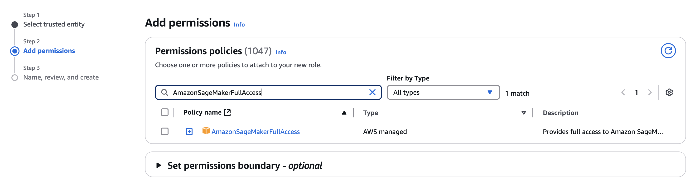
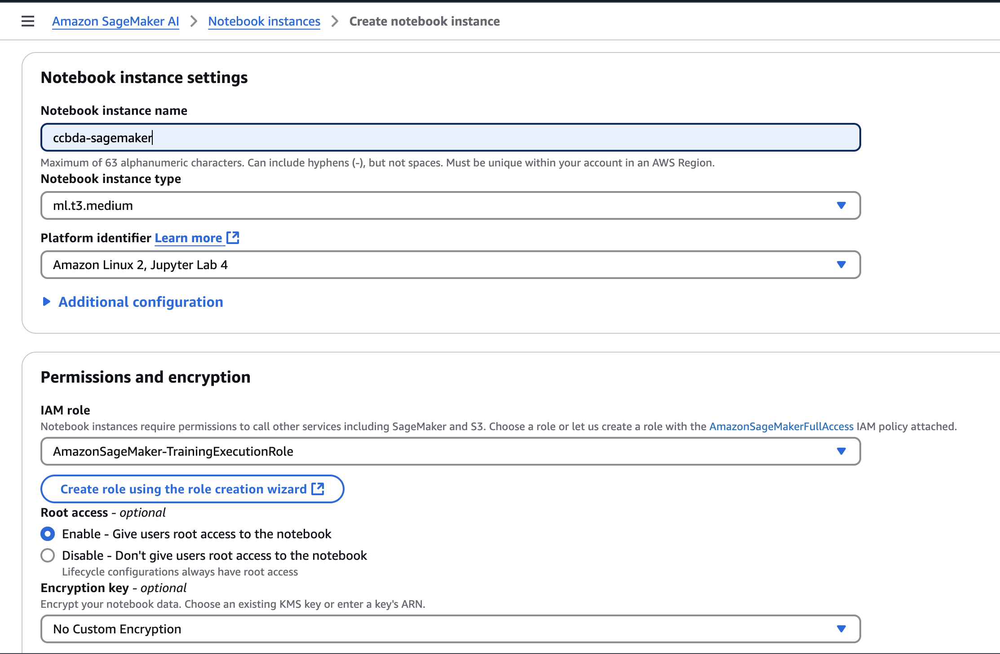
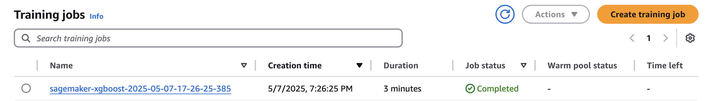
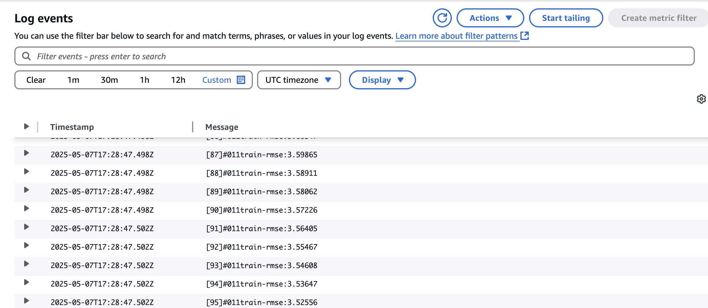
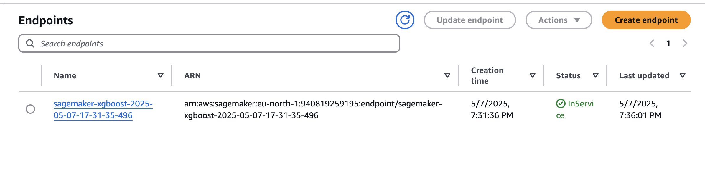
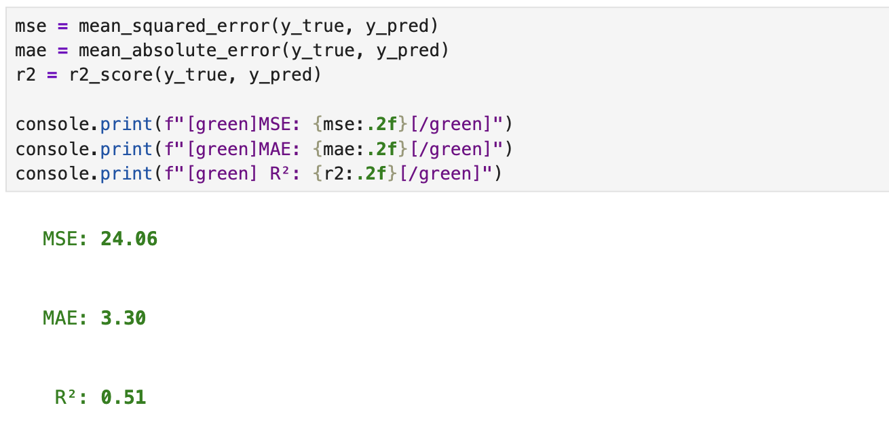

# AWS SageMaker AI

> [!NOTE]
> AWS Learner Lab does not provide sufficient permissions to follow this tutorial. It is recommended to use your own AWS Account (eligible under the Free Tier).

This tutorial walks you through utilizing **AWS SageMaker** to create, train, and deploy your own machine learning models in a serverless architecture. You'll also build a simple ML workflow that automates the entire pipeline without requiring local GPU resources.

---

## AWS SageMaker AI - Core Concepts

### Jupyter Notebooks
Amazon SageMaker provides fully managed Jupyter notebook instances that allow data scientists and developers to prepare and process data, write code to train models, and deploy trained models to production.

### Training Jobs
Training jobs are managed ML tasks executed on scalable AWS infrastructure. SageMaker lets you choose built-in algorithms, custom containers, or your own scripts to run training jobs with ease and reproducibility.

### Endpoints
After training, SageMaker allows you to deploy your models as persistent or serverless endpoints that can be used for real-time predictions.


## Task 1.1 - IAM Configuration

Create a new IAM Role in **IAM > Access Management > Roles** with the following trust policy:

```json
{
  "Version": "2012-10-17",
  "Statement": [
    {
      "Effect": "Allow",
      "Principal": {
        "Service": "sagemaker.amazonaws.com"
      },
      "Action": "sts:AssumeRole"
    }
  ]
}
```
In the next section attach the `AmazonSageMakerFullAccess` permission:


Name the role `AmazonSageMaker-TrainingExecutionRole`.

## Task 1.2 - S3 Configuration

Create a new S3 bucket named: `ccbda-research-sagemaker `using all default settings.


## Task 2.1 - Create and Configure Jupyter Notebook

Navigate to **Amazon SageMaker > Applications and IDEs > Notebooks**. Click Create notebook instance, give it a name, and select the IAM Role `AmazonSageMaker-TrainingExecutionRole`.




Then click on your newly created instance's button `Open JupyterLab`. Wait a while and find the button to upload your own file. Take the [notebook](./sagemaker_ml.ipynb) from this repository and upload it.

Run each cell using the Run button or `Shift + Enter`.


## Task 2.2 - Work with Jupyter Notebook


You’ll work on a regression problem: predicting hourly bike rentals based on weather conditions. You'll clean and preprocess data, store it in S3, train a model using SageMaker, deploy it, and create a live endpoint for inference.


## Task 2.2.1 - Download the data

Use the following code to load the dataset:
```python
url = "https://archive.ics.uci.edu/ml/machine-learning-databases/00560/SeoulBikeData.csv"
df = pd.read_csv(url, encoding='unicode_escape')
```

## Task 2.2.2 - Clean the data

In regression tasks, data preparation is crucial:
1. One-hot encode or drop string columns like "Season".
2. Drop unnecessary columns (e.g., "Date").
3. Convert categorical strings to integers when meaningful.
4. (Optional) Standardize column names for consistency.

Using [pandas documentation](https://pandas.pydata.org/docs/reference/api/pandas.DataFrame.drop.html) fill out a cell which will drop unnecesarry columns:

```python
df.columns = df.columns.str.replace(' ', '_').str.replace('(', '').str.replace(')', '')
df['Hour'] = df['Hour'].astype(int)
# Drop columns here

y = df['Rented_Bike_Count']
X = df.drop(columns=['Rented_Bike_Count'])

full_df = pd.concat([y, X], axis=1)
full_df.to_csv("bike_data.csv", header=False, index=False)
full_df.head()
```

## Task 2.2.3 - Split the data into train and test 

Using [train_test_split](https://scikit-learn.org/stable/modules/generated/sklearn.model_selection.train_test_split.html) rom scikit-learn to split the dataset (80/20). Execute the cell and make sure that you can see `train.csv` and `test.csv` files.

## Task 2.2.4 - Upload processed data to the S3 bucket

Follow notebook execution to this cell:
```python
import boto3


s3 = boto3.client("s3")


# uploda to S3
```
Upload your train to the `f"{prefix}/train/bike_data.csv"` and test to the `f"{prefix}/test/bike_data.csv"`.


Make sure to update your IAM role ARN with your actual account ID:
```python
role = "arn:aws:iam::<account_id>:role/AmazonSageMaker-TrainingExecutionRole"
```

## Task 2.2.5 - Create a Training Job

This section sets up an XGBoost training job in SageMaker:

```python
xgboost_image_uri = image_uris.retrieve("xgboost", region=region, version="1.5-1")

estimator = Estimator(
    image_uri=xgboost_image_uri,
    role=role,
    instance_count=1,
    instance_type="ml.m5.large",
    volume_size=5,
    max_run=3600,
    output_path=f"s3://{bucket}/{prefix}/output",
    sagemaker_session=session,
)

# XGBoost Hyperparameters
estimator.set_hyperparameters(
    objective="reg:squarederror",
    num_round=100,
    max_depth=5,
    eta=0.2,
    subsample=0.8,
    colsample_bytree=0.8,
)
```

You can see it in the Amazon SageMaker AI -> Training -> Training jobs. After a few minutes it should be completed:



SageMaker automatically will create a log group in the CloudWatch. Click on the training job, scroll down to the Monitor section and click View Logs, then go to the log stream. 


From the image above we can see that that rmse value is decreasing during the training which is an expected behaviour.

## Task 2.2.5 - Deploy a Training Job

Using the following code create an endpoint:
```python
predictor = estimator.deploy(initial_instance_count=1, instance_type="ml.m5.large")
```

After a few minutes you can see it in the Amazon SageMaker -> Inference -> Endpoints.


Now it is ready to be used by any other service.


## Task 2.2.5 - Test your endpoint

Regression task can be validated by calculating the following metrics: 
1. Mean Squared Error (MSE) – penalizes large errors more.
2. Mean Absolute Error (MAE) – average absolute difference between predicted and true values.
3. R² Score – proportion of variance explained by the model.


```python
from sklearn.metrics import mean_squared_error, mean_absolute_error, r2_score
```

In this cell finish up the code utilizing [invoke_endpoint](https://boto3.amazonaws.com/v1/documentation/api/latest/reference/services/sagemaker-runtime/client/invoke_endpoint.html) function:
```python
y_pred = []
for i in track(range(len(X)), description="Predicting..."):
    ## add prediction to y_pred
```


Results should be similar to the following:


How to interpret results:
- MSE of 24.06 means on average, your squared error per prediction is ~24 units (bike count units).

- MAE of 3.3 means the typical prediction is off by about 3 bikes — pretty reasonable depending on your scale.

- R² = 0.51 indicates the model explains 51% of the variance in the data 
---


> [!Note]
> If you encounter any problem and you are unable to complete some task regarding the Jupyter Notebooks, there is a final [sagemaker_ml_done.ipynb](./sagemaker_ml_done.ipynb) file which has all of the ready code.